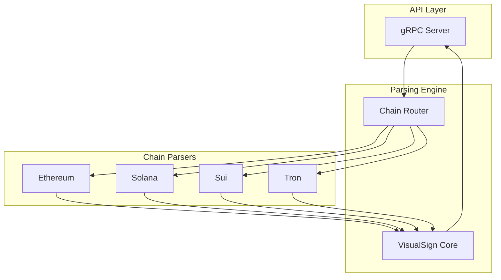

# VisualSign Parser

Rust-based transaction parser that converts raw blockchain transactions into human-readable VisualSign payloads.

## What is VisualSign?

VisualSign transforms opaque transaction data (hex strings, base64 blobs) into structured, human-readable JSONs that clearly decode transaction details. See the [full documentation](https://anchorageoss.github.io/visualsign-display).
You can follow the [Wallet Integration Guide](https://github.com/anchorageoss/visualsign-turnkeyclient/blob/main/WALLET_INTEGRATION_GUIDE.md) that uses [AWS Nitro Verifier Library](https://github.com/anchorageoss/awsnitroverifier) and our minimal [VisualSign TurnkeyClient](https://github.com/anchorageoss/visualsign-turnkeyclient) to help you understand and bootstrap the security process.

## Supported Chains

- Ethereum (+ L2s: Arbitrum, Optimism, Base, Polygon)
- Solana
- Sui
- Tron

You can follow the [Chain Addition Guide](https://github.com/anchorageoss/visualsign-parser/wiki/Adding-a-new-chain-to-Visualsign-Parser) to learn how to add a new chain. Often the basic chain addition can be done within a working day if you have a high quality Rust SDK, but we are currently deploying a single binary and are not focusing on expanding chains broadly until we have further solidified design patterns and dApp Frameworks. If you are a blockchain that wants to be included in VisualSign, [join the community on Telegram](https://t.me/+B03D2m1WlBBiYTdh).

## Architecture



## Quick Start

### CLI

```sh
cargo run --manifest-path src/Cargo.toml --bin parser_cli -- --chain ethereum -t '0xf86c808504a817c800825208943535353535353535353535353535353535353535880de0b6b3a76400008025a028ef61340bd939bc2195fe537567866003e1a15d3c71ff63e1590620aa636276a067cbe9d8997f761aecb703304b3800ccf555c9f3dc64214b297fb1966a3b6d83' --output json
```

Output:
```json
{
  "Fields": [
    {
      "FallbackText": "Unknown Network (Chain ID: 37)",
      "Label": "Network",
      "TextV2": {
        "Text": "Unknown Network (Chain ID: 37)"
      },
      "Type": "text_v2"
    },
    {
      "AddressV2": {
        "Address": "0x3535353535353535353535353535353535353535",
        "Name": "To",
        "AssetLabel": "Test Asset"
      },
      "FallbackText": "0x3535353535353535353535353535353535353535",
      "Label": "To",
      "Type": "address_v2"
    },
    {
      "AmountV2": {
        "Abbreviation": "ETH",
        "Amount": "1"
      },
      "FallbackText": "1 ETH",
      "Label": "Value",
      "Type": "amount_v2"
    },
    {
      "FallbackText": "21000",
      "Label": "Gas Limit",
      "TextV2": {
        "Text": "21000"
      },
      "Type": "text_v2"
    },
    {
      "FallbackText": "20 gwei",
      "Label": "Gas Price",
      "TextV2": {
        "Text": "20 gwei"
      },
      "Type": "text_v2"
    },
    {
      "FallbackText": "0",
      "Label": "Nonce",
      "TextV2": {
        "Text": "0"
      },
      "Type": "text_v2"
    }
  ],
  "PayloadType": "EthereumTx",
  "Title": "Ethereum Transaction",
  "Version": "0"
}
```

### gRPC Server

```sh
make -C src parser  # Starts server on port 44020
```

```sh
grpcurl -plaintext -d '{"unsigned_payload": "0x...", "chain": "CHAIN_ETHEREUM"}' \
  localhost:44020 parser.ParserService/Parse
```

## Documentation

Full documentation at **https://anchorageoss.github.io/visualsign-display**:
- [Field Types Reference](https://anchorageoss.github.io/visualsign-display/docs/field-types)
- [Integration Guide](https://anchorageoss.github.io/visualsign-display/docs/integration)
- [Parser CLI](https://anchorageoss.github.io/visualsign-display/docs/parser-cli)

## Development

```sh
make -C src test    # Run tests
make -C src fmt     # Format code
make -C src lint    # Run clippy
```

## Contributing

See [CONTRIBUTING.md](CONTRIBUTING.md) for development workflow and [GOVERNANCE.md](GOVERNANCE.md) for project governance.

## Security

Report vulnerabilities per [SECURITY.md](SECURITY.md).

## License

Apache 2.0
