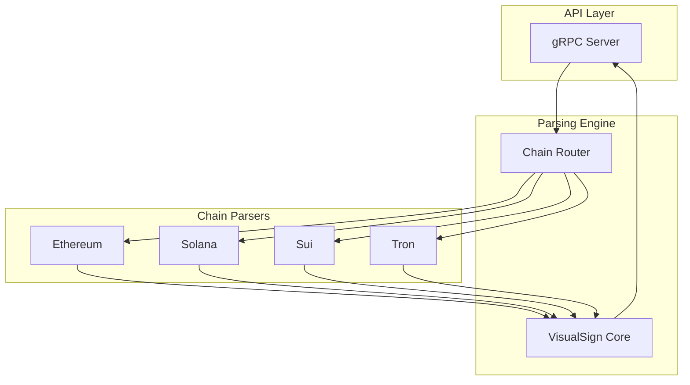

# VisualSign Parser

Rust-based transaction parser that converts raw blockchain transactions into human-readable VisualSign payloads.

## What is VisualSign?

VisualSign transforms opaque transaction data (hex strings, base64 blobs) into structured, human-readable JSONs that clearly decode transaction details. See the [full documentation](https://anchorageoss.github.io/visualsign-display).
You can follow the [Wallet Integration Guide](https://github.com/anchorageoss/visualsign-turnkeyclient/blob/main/WALLET_INTEGRATION_GUIDE.md) that uses [AWS Nitro Verifier Library](https://github.com/anchorageoss/awsnitroverifier) and our minimal [VisualSign TurnkeyClient](https://github.com/anchorageoss/visualsign-turnkeyclient) to help you understand and bootstrap the security process.

## Supported Chains

- Ethereum (+ L2s: Arbitrum, Optimism, Base, Polygon)
- Solana
- Sui
- Tron

You can follow the [Chain Addition Guide](https://github.com/anchorageoss/visualsign-parser/wiki/Adding-a-new-chain-to-Visualsign-Parser) to learn how to add a new chain. Often the basic chain addition can be done within a working day if you have a high quality Rust SDK, but we are currently deploying a single binary and are not focusing on expanding chains broadly until we have further solidified design patterns and dApp Frameworks. If you are a blockchain that wants to be included in VisualSign, [join the community on Telegram](https://t.me/+B03D2m1WlBBiYTdh).

## Architecture



## Quick Start

### CLI

```sh
cargo run --manifest-path src/Cargo.toml --bin parser_cli -- --chain ethereum -t '0xf86a80847735940082520894582e394c83f23aa795f098f976e44a24ab813e81871f56d1046658008026a0afba1e61a7ac07e7503521bf52ef61f99424791127c8772f4ed5077f59fc2e1da008e3a3179ad436ffb079885ab5423044512b2fc373448b02e57b13c0fd42973a' --output human
```

Output:
```json
{
  "Version": "0",
  "Title": "Ethereum Transaction",
  "PayloadType": "EthereumTx",
  "Fields": [
    {"Label": "To", "FallbackText": "0x3535...", "Type": "address_v2", "AddressV2": {"Address": "0x3535..."}},
    {"Label": "Value", "FallbackText": "1 ETH", "Type": "amount_v2", "AmountV2": {"Amount": "1", "Abbreviation": "ETH"}}
  ]
}
```

### gRPC Server

```sh
make -C src parser  # Starts server on port 44020
```

```sh
grpcurl -plaintext -d '{"unsigned_payload": "0x...", "chain": "CHAIN_ETHEREUM"}' \
  localhost:44020 parser.ParserService/Parse
```

## Documentation

Full documentation at **https://anchorageoss.github.io/visualsign-display**:
- [Field Types Reference](https://anchorageoss.github.io/visualsign-display/docs/field-types)
- [Integration Guide](https://anchorageoss.github.io/visualsign-display/docs/integration)
- [Parser CLI](https://anchorageoss.github.io/visualsign-display/docs/parser-cli)

## Development

```sh
make -C src test    # Run tests
make -C src fmt     # Format code
make -C src lint    # Run clippy
```

## Contributing

See [CONTRIBUTING.md](CONTRIBUTING.md) for development workflow and [GOVERNANCE.md](GOVERNANCE.md) for project governance.

## Security

Report vulnerabilities per [SECURITY.md](SECURITY.md).

## License

Apache 2.0
