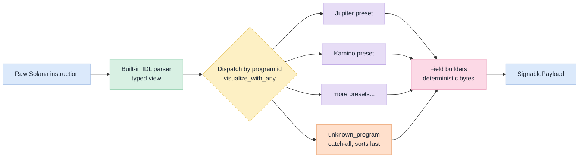
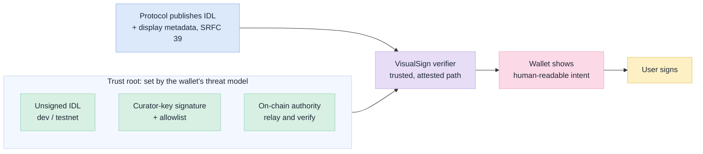

Across April and May 2026, VisualSign gained decoding for Jupiter (Borrow, Earn, Perpetuals, v6 route_v2), Kamino (Borrow, Vault, Farms, Limit Orders), Meteora (DLMM, DAMM V2), MetaDAO (Futarchy, Conditional Vault), Orca Whirlpool, Onre App, Neutral Trade, DFlow Aggregator, and Exponent Finance. Seventeen presets across nine protocols. Each PR added a directory under `src/chain_parsers/visualsign-solana/src/presets/`, a one-line module declaration, and a handful of fixtures. None of them changed how any of the other presets decode, and none of them touched the core parser.

That comes from a few composition primitives the Solana decoder is built on.

## The three pieces

VisualSign's Solana decoder is built from three layers you can think about independently:

1. **A built-in IDL parser.** Any Anchor-style program with an IDL can be decoded into a typed view of each instruction — discriminator, account list, argument values — produced generically from the IDL alone. This is the `solana_parser` crate's `parse_instruction_with_idl`, fed by the `src/idl/` registry. It does not know about Jupiter or Kamino.

2. **Protocol-specific preset overlays.** A preset is a small unit that says "for *this* program id, decode the instruction and produce these human-readable fields." Presets implement `InstructionVisualizer` and declare which program id they handle via `SolanaIntegrationConfig`. The core hands each preset a `VisualizerContext` carrying the raw instruction plus the IDL registry; the preset calls `parse_instruction_with_idl` to get the typed view, then calls field builders (`create_text_field`, `create_amount_field`, `create_raw_data_field`) to shape output. Each preset lives in its own directory.

3. **A build-time registry.** `build.rs` scans `src/presets/` and emits a generated `available_visualizers()` function — one `Box::new(<Dir>::<Pascal>Visualizer)` per directory. The build comment in the script states the design intent: the generated function lets VisualSign functionally compose instructions at display time. `build.rs` discovers each directory's visualizer automatically, so there's no central dispatch table to hand-edit. The one piece of wiring that stays manual is the `pub mod <dir>;` line in `src/presets/mod.rs` that makes Rust compile the new module.

Field builders sit underneath all three layers. They enforce shape and determinism, so two presets emitting the same logical content produce byte-identical output. That property is what makes the composed payload safe to hash.

## What happens when a transaction lands

A Solana transaction is, in VisualSign's view, a list of instructions. Decoding is a fold over them: each instruction is matched to the first preset that can handle it, and the emitted fields collect into one payload.



In code:

```text
for each instruction in the transaction:
    visualize_with_any(available_visualizers(), context)
        -> first preset whose can_handle() returns true
        -> preset emits an AnnotatedPayloadField
collect fields -> SignablePayload
```

`available_visualizers()` is the generated list (a `Vec<Box<dyn InstructionVisualizer>>`). `unknown_program` always sorts last, so it catches anything no specific preset claimed. A preset registered for Jupiter's program id has zero knowledge of MetaDAO's preset, and vice versa. The dispatch lookup is the only coupling.

This is why the preset wave required no changes to the core. Each new preset added:

- The IDL JSON (or accepted the built-in IDL path).
- One preset `mod.rs` implementing `InstructionVisualizer`.
- One `config.rs` implementing `SolanaIntegrationConfig` with the program id.
- Fixture tests under `tests/fixtures/`.
- One `pub mod <dir>;` line in `src/presets/mod.rs`.

The only shared file a preset PR touches is that module list, and only to append a line. It leaves existing decoders, the dispatch path, and the core types alone, so reviewers can read each preset PR on its own.

## What composability buys you

If you're **adding a new Solana protocol**, the design pushes you toward a particular shape: one IDL, one visualizer, one config, a handful of fixtures, one new directory, and the `pub mod` line that registers it. The same shape your reviewer expects, the same shape we expect from ourselves. When the protocol exposes an on-chain IDL, the scaffolding in [Adding a Solana preset](/chains/solana) generates all of this for you, including the module declaration.

If you're **integrating VisualSign into a wallet**, composability is built into the data layer. The Ethereum side models token resolution as a `LayeredRegistry<T>`: a request-scoped registry layered over the compiled-in defaults, so wallet-provided overrides can take precedence at lookup time without forking VisualSign. The layering exists today, and wiring wallet-supplied token metadata into that request layer is not done yet (`create_layered_registry` in `visualsign-ethereum/src/lib.rs` uses defaults only for now). The Solana side composes through fixed IDL + preset layers, and bringing wallet-side overlays to both chains is the [next step we're tracking](https://github.com/anchorageoss/visualsign-parser/issues/376).

If you're **building a policy engine or signing pipeline on top of VisualSign**, the chain metadata and content digests in the HTTP gateway give you a stable input contract. The gateway forwards `chain_metadata` end-to-end and exposes payload digests on every response. Your policy logic composes onto our parser output without re-parsing or re-decoding.

If you're **writing tests**, surfpool composes real Solana mainnet state into the local harness. Tests run against a local mainnet fork backed by live RPC (Helius, a custom `SOLANA_RPC_URL`, or public mainnet-beta). They need network access to pull that state, and nothing is ever sent to a live cluster. Forking real chain data catches drift between IDL assumptions and on-chain reality.

## Composing with ClearSign

This shape pays off past our own repo. Solana's clear-signing proposal, [SRFC 39](https://github.com/solana-foundation/SRFCs/discussions/4), asks protocols to enrich their IDLs with display metadata — instruction summaries, account labels, value formatters — so a wallet can show what a transaction does before anyone signs it. Protocols describe their own interactions; wallets render them. That is the same division of labor VisualSign already runs on, and the one our [vision and roadmap](/vision-roadmap) starts from: the IDL is the contract, and the preset is where protocol-specific display lives.

VisualSign implements the reader side of that standard. The IDL parser is the layer SRFC 39 is written for, so the display metadata a protocol publishes lands in the same typed view a preset already reads. The richer that published IDL gets, the more VisualSign can render from the IDL alone, with a thinner protocol-specific preset on top. Protocols that haven't adopted the standard are still covered by a preset today, so coverage doesn't wait on the spec landing.

VisualSign also answers the security worry the proposal raises. It treats a caller-supplied IDL as untrusted, display-only input: rendering happens on a trusted, attested path, and a crafted IDL cannot relabel a program or hide a destination. [As we argued on the SRFC](https://github.com/solana-foundation/SRFCs/discussions/4#discussioncomment-15500615), the wallet should act as a verifier that decouples display logic from the dapp. Clear signing decides what a wallet shows; VisualSign is where the wallet can trust that what it showed is what gets signed.

How far to carry IDL verification is a wallet's decision, set by its business and threat model. An IDL can carry an ed25519 signature bound to its program id, which VisualSign checks against a curator allowlist, and unsigned IDLs are still accepted as graceful degradation. A wallet that wants a firmer root can relay the on-chain IDL and verify it against the program's upgrade authority, or trust a shared curator key that an auditor controls for several wallets at once. Teams on testnets often prefer unsigned IDLs to keep the development loop fast and avoid publishing on chain before they are ready. VisualSign supplies the verifier, and each wallet chooses where the trust root sits.



Ethereum has the same arc with ERC-7730 (also on the [roadmap](/vision-roadmap)). Each chain arrives with its own clear-signing standard, and each one plugs into the same three primitives. Every chain we add widens the surface those standards can cover, so this only gets stronger as VisualSign grows.

## Keeping it composable as it grows

A label like "composable by design" only earns its keep if the design still works once there are fifty presets instead of seventeen. Three things do most of that work. Build-time discovery keeps the generated registry in step with the directories on disk; the one list a contributor still edits by hand is the `mod.rs` module declarations, and forgetting a line breaks the build right away. Field builders give two contributors who emit the same content the same bytes. And the shared IDL parser hands every preset the same typed view of an instruction, so each one decodes against a consistent shape.

The preset wave shows this works at the current size. The real test is the next chain we add, and whether these same primitives carry over.

To start adding a Solana preset, see [Adding a Solana preset](/chains/solana). To see what shipped recently, see the [Changelog](/changelog).
