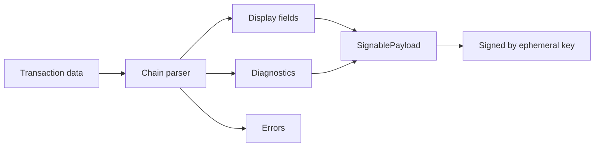

The lint framework allows chain parsers to report data quality issues as structured diagnostics that are attested alongside display fields in the signed payload. This replaces silent data dropping with transparent, machine-readable reporting.

## Architecture



Three categories of issues:

| Category | Where it goes | Who handles it | Example |
|----------|---------------|----------------|---------|
| **Display fields** | `SignablePayload.Fields` | Wallet UI renders them | Network name, instruction details |
| **Diagnostics** | `SignablePayload.Fields` (as `Diagnostic` variant) | Attested -- HSM/auditor can verify | OOB indices, empty account keys |
| **Errors** | `DecodeInstructionsResult.errors` | Consumer decides | No visualizer found |

## Adding a diagnostic to a chain parser

### 1. Import the builder

```rust
use visualsign::field_builders::create_diagnostic_field;
use visualsign::lint::LintConfig;
```

### 2. Accept `LintConfig` in your decode function

```rust
pub fn decode_instructions(
    transaction: &MyTransaction,
    lint_config: &LintConfig,
) -> DecodeResult {
```

### 3. Check severity and emit

```rust
let severity = lint_config.severity_for(
    "transaction::my_rule",
    visualsign::lint::Severity::Warn,
);

if !matches!(severity, visualsign::lint::Severity::Allow) {
    diagnostics.push(create_diagnostic_field(
        "transaction::my_rule",
        "transaction",
        severity.clone(),
        &format!("description of what went wrong"),
        Some(instruction_index as u32),
    ));
}
```

`create_diagnostic_field` automatically emits `tracing::warn!` for warn and error-level diagnostics, giving operators production log visibility without any extra code in chain parsers.

### 4. Emit ok-level diagnostics for rules that pass

When `report_all_rules` is enabled, rules that find no issues still report:

```rust
if issue_count == 0 && lint_config.should_report_ok("transaction::my_rule") {
    diagnostics.push(create_diagnostic_field(
        "transaction::my_rule",
        "transaction",
        visualsign::lint::Severity::Ok,
        &format!("all {} items checked successfully", total),
        None,
    ));
}
```

This provides boot-metric-style attestation -- the verifier can confirm every expected rule ran.

### 5. Return results separately

```rust
DecodeInstructionsResult {
    fields,      // display fields for the wallet UI
    errors,      // per-instruction parser errors
    diagnostics, // data quality diagnostics for attestation
}
```

The caller (`visualsign.rs`) appends diagnostics after all display fields.

## Rule naming conventions

Rules follow the `domain::rule_name` format:

- **`transaction::oob_program_id`** -- instruction's program_id_index is out of bounds in account_keys
- **`transaction::oob_account_index`** -- instruction references out-of-bounds account index in account_keys
- **`transaction::empty_account_keys`** -- transaction has no account keys
- **`decode::visualizer_error`** -- a visualizer failed to decode an instruction (always-on, not configurable via LintConfig)

Domains reflect who owns the problem:

| Domain | Scope |
|--------|-------|
| `transaction` | Raw transaction structure validity |
| `decode` | Instruction data interpretation |
| `account` | Account metadata and resolution |
| `wallet` | Caller-provided data quality |
| `idl` | IDL content and structure (Solana) |
| `abi` | ABI content and structure (Ethereum) |

## `LintConfig`

Controls diagnostic behavior:

```rust
use visualsign::lint::{LintConfig, Severity};

// Default: all rules at default severity, ok-level diagnostics enabled
let config = LintConfig::default();

// Custom: override specific rules
let config = LintConfig {
    overrides: HashMap::from([
        ("transaction::oob_account_index".to_string(), Severity::Allow),
    ]),
    report_all_rules: true,
};
```

**Severity levels:**
- `Ok` -- rule ran and found no issues
- `Warn` -- data quality issue found, parsing continued
- `Error` -- serious issue found
- `Allow` -- rule suppressed, no diagnostic emitted

## Deterministic serialization

Diagnostic fields follow the same deterministic serialization rules as all other `SignablePayloadField` variants:

- Alphabetical key ordering at every nesting level
- ASCII-only content
- Optional fields omitted when `None` (e.g., `InstructionIndex`)

This ensures diagnostics are covered by the same signing and attestation flow as display fields.

## Testing diagnostics

```rust
#[test]
fn test_my_rule_emits_diagnostic() {
    let config = LintConfig::default();
    let result = decode_instructions(&tx, &registry, &config);

    let warns: Vec<_> = result.diagnostics
        .iter()
        .filter_map(|f| match &f.signable_payload_field {
            SignablePayloadField::Diagnostic { diagnostic, .. }
                if diagnostic.level == "warn" => Some(diagnostic),
            _ => None,
        })
        .collect();

    assert_eq!(warns.len(), 1);
    assert_eq!(warns[0].rule, "transaction::my_rule");
}
```

### Updating fixtures and snapshots when adding rules

Adding a new rule that emits ok-level diagnostics changes the output of every transaction parse. You must update:

1. **CLI fixtures** -- regenerate the `*.display.expected` fixtures and the matching `*.diagnostics.expected` fixtures by running the CLI against the fixture inputs:

   ```bash
   cargo run --bin parser_cli -- $(cat src/parser/cli/tests/fixtures/solana-json.input | tr '\n' ' ') > src/parser/cli/tests/fixtures/solana-json.display.expected
   cargo run --bin parser_cli -- $(cat src/parser/cli/tests/fixtures/solana-text.input | tr '\n' ' ') > src/parser/cli/tests/fixtures/solana-text.display.expected
   ```

   For JSON fixtures, filter diagnostics from the display expected file and update the diagnostics expected file separately.

2. **Integration test expected JSON** -- update `src/integration/tests/parser.rs` to include the new diagnostic fields in the `expected_sp` JSON

3. **Field count assertions** -- tests that assert `payload.fields.len()` (e.g., swig_wallet tests) need their counts updated to include the new ok-level diagnostics

4. **Fuzz and proptest** -- run `cargo test -p visualsign-solana --test fuzz_idl_parsing` and `--test pipeline_integration` to verify no regressions

Run `make -C src fmt && make -C src lint && make -C src test` to verify everything passes before pushing.
