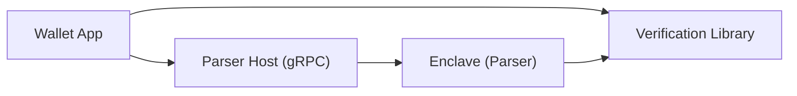

## Architecture overview



## Integration steps

### 1. Connect to parser service

The parser exposes a gRPC service. You can connect using any gRPC client library.

**Proto Definition:**
```protobuf
service ParserService {
  rpc Parse(ParseRequest) returns (ParseResponse);
}

message ParseRequest {
  string unsigned_payload = 1;  // Base64 or hex encoded transaction
  Chain chain = 2;              // CHAIN_ETHEREUM, CHAIN_SOLANA, etc.
  ChainMetadata chain_metadata = 3; // Optional chain-specific data
}
```

### 2. Parse transactions

Send raw transactions to the parser:

**Go Example:**
```go
import (
    pb "your-project/parser"
    "google.golang.org/grpc"
)

// Connect to parser
conn, err := grpc.Dial("localhost:44020", grpc.WithInsecure())
client := pb.NewParserServiceClient(conn)

// Parse transaction
resp, err := client.Parse(context.Background(), &pb.ParseRequest{
    UnsignedPayload: "0xf86c80850...", // Your raw transaction
    Chain: pb.Chain_CHAIN_ETHEREUM,
})

// Extract VisualSign JSON
visualSignJSON := resp.ParsedTransaction.Payload.SignablePayload
```

**JavaScript/TypeScript Example:**
```typescript
import { ParserServiceClient } from './generated/parser_grpc_pb';
import { ParseRequest, Chain } from './generated/parser_pb';

const client = new ParserServiceClient('localhost:44020');

const request = new ParseRequest();
request.setUnsignedPayload('0xf86c80850...');
request.setChain(Chain.CHAIN_ETHEREUM);

client.parse(request, (error, response) => {
    if (!error) {
        const visualSignJSON = response.getParsedTransaction()
            .getPayload()
            .getSignablePayload();
        // Display to user
    }
});
```

### 3. Verify attestation

**IMPORTANT**: Always verify the enclave attestation before trusting the parsed output.

The parser response includes an attestation document and a signature. You must first verify the attestation to extract a trusted public key, then use that key to verify the signature:

```go
// 1. Verify the AWS Nitro attestation document and extract the enclave's public key
//    See the Verification guide for full implementation details
attestationDoc := resp.Attestation
enclavePubKey, err := verifyAttestationAndExtractKey(attestationDoc)
if err != nil {
    return fmt.Errorf("attestation verification failed: %w", err)
}

// 2. Verify the parser's signature using the attested public key
signature := resp.ParsedTransaction.Signature
message := signature.Message
sig := signature.Signature

// Verify using P256 ECDSA with the key derived from the attestation document
valid := verifyP256Signature(enclavePubKey, message, sig)
```

See [Verification](./verification) for the complete attestation verification implementation.

### 4. Display to user

Parse the VisualSign JSON and display it in your UI:

```typescript
const visualSign = JSON.parse(visualSignJSON);

// Display transaction details
console.log(`Transaction: ${visualSign.Title}`);
visualSign.Fields.forEach(field => {
    switch(field.Type) {
        case 'text_v2':
            console.log(`${field.Label}: ${field.TextV2.Text}`);
            break;
        case 'amount_v2':
            console.log(`${field.Label}: ${field.AmountV2.Amount} ${field.AmountV2.Abbreviation}`);
            break;
        case 'address_v2':
            console.log(`${field.Label}: ${field.AddressV2.Address}`);
            break;
    }
});
```

## Chain-specific metadata

### Ethereum - ABI support

For smart contract interactions, provide the ABI:

```go
request := &pb.ParseRequest{
    UnsignedPayload: txBytes,
    Chain: pb.Chain_CHAIN_ETHEREUM,
    ChainMetadata: &pb.ChainMetadata{
        Metadata: &pb.ChainMetadata_Ethereum{
            Ethereum: &pb.EthereumMetadata{
                Abi: &pb.Abi{
                    Value: contractABI, // JSON ABI string
                },
            },
        },
    },
}
```

### Solana - IDL support

For Anchor programs, provide the IDL:

```go
request := &pb.ParseRequest{
    UnsignedPayload: txBytes,
    Chain: pb.Chain_CHAIN_SOLANA,
    ChainMetadata: &pb.ChainMetadata{
        Metadata: &pb.ChainMetadata_Solana{
            Solana: &pb.SolanaMetadata{
                Idl: &pb.Idl{
                    Value: anchorIDL, // JSON IDL string
                    IdlType: pb.SolanaIdlType_SOLANA_IDL_TYPE_ANCHOR,
                },
            },
        },
    },
}
```

## Error handling

The parser may return errors for invalid transactions:

```go
resp, err := client.Parse(ctx, request)
if err != nil {
    // Handle gRPC error
    status := status.Convert(err)
    log.Printf("Parse failed: %v", status.Message())
}
```

## Health checks

Monitor parser health:

```bash
grpcurl -plaintext -d '{"service":""}' \
    localhost:44020 grpc.health.v1.Health/Check
```

## Security considerations

1. **Always verify attestations** - Don't trust parsed output without verification
2. **Use TLS in production** - Enable TLS for gRPC connections
3. **Validate signatures** - Check the P256 signature on all responses
4. **Monitor PCR values** - Keep allowlists updated for enclave measurements

## Example: Complete integration

```go
package main

import (
    "context"
    "encoding/json"
    "log"

    pb "your-project/parser"
    "google.golang.org/grpc"
)

func parseAndDisplayTransaction(rawTx string) error {
    // Connect to parser
    conn, err := grpc.Dial("localhost:44020", grpc.WithInsecure())
    if err != nil {
        return err
    }
    defer conn.Close()

    client := pb.NewParserServiceClient(conn)

    // Parse transaction
    resp, err := client.Parse(context.Background(), &pb.ParseRequest{
        UnsignedPayload: rawTx,
        Chain: pb.Chain_CHAIN_ETHEREUM,
    })
    if err != nil {
        return err
    }

    // Verify signature
    sig := resp.ParsedTransaction.Signature
    if !verifySignature(sig) {
        return fmt.Errorf("invalid signature")
    }

    // Parse VisualSign JSON
    var visualSign map[string]interface{}
    err = json.Unmarshal([]byte(resp.ParsedTransaction.Payload.SignablePayload), &visualSign)
    if err != nil {
        return err
    }

    // Display to user
    displayTransaction(visualSign)

    return nil
}
```

## Testing

Use the CLI to test transaction parsing locally. The `-o human` flag provides a readable output format.

**Ethereum (native transfer):**
```bash
cargo run --bin parser_cli -- --chain ethereum -o human -t '0xf86c808504a817c800825208943535353535353535353535353535353535353535880de0b6b3a76400008025a028ef61340bd939bc2195fe537567866003e1a15d3c71ff63e1590620aa636276a067cbe9d8997f761aecb703304b3800ccf555c9f3dc64214b297fb1966a3b6d83'
```

Expected output:
```
┌─ Transaction: Ethereum Transaction
│  Version: 0
│  Type: EthereumTx
│
└─ Fields:
   ├─ Network: Ethereum Mainnet
   ├─ To: 0x3535353535353535353535353535353535353535
   ├─ Value: 1 ETH
   ├─ Gas Limit: 21000
   ├─ Gas Price: 20 gwei
   └─ Nonce: 0
```

**Solana (Jupiter swap):**
```bash
cargo run --bin parser_cli -- --chain solana -o human -t 'AQAAAAAAAAAAAAAAAAAAAAAAAAAAAAAAAAAAAAAAAAAAAAAAAAAAAAAAAAAAAAAAAAAAAAAAAAAAAAAAAAAAAAABAAkSTXq/T5ciKTTbZJhKN+HNd2Q3/i8mDBxbxpek3krZ664CMz4dTWd4gwDq6aKU/sqHgTzleVA7bTCOy59kSOO+0EPkGS7bWuT/2yiCuaADtj/v6d+KwyTj46OQM2MjIq6hTqzVdwLTW8t+UsWMrwHEvc/r814OmVR9yLVQZujbWvpTh0XSNlF7uoIvuHyKD/16mBElrNa/eT8vB1KVUaN8IoaTvZbN4b7iiv8Q8cl5bDecNqCXzTS1Xmsmh5b2UVZniTbtX0AYG5QKiSDC10m0caM6frmEVukpjEWOk7F/0OzFKL0A0HdMWTIMuQj4xBuP3csLyGzVO/MXtPu6woNViO2O9ocxd1YSDcIwhrzHY3a9ewvycRH5q662TcQqdxD6AAAAAAAAAAAAAAAAAAAAAAAAAAAAAAAAAAAAAAAAAAAEedVb8jHAbu50xW7OaBUH/bGy3qP0jlECsc2iVrwTjwabiFf+q4GE+2h/Y0YYwDXaxDncGus7VZig8AAAAAABBt324ddloZPZy+FGzut5rBy0he1fWzeROoz1hX7/AKkOA2hfjpCQU+RYEhxm9adq7cdwaqEcgviqlSqPK3h5qVJNNVq4xx0JIWWE9kFLvpQK5lvS5UCde3W3QfWYLIxYjJclj04kifG7PRApFI4NgwtaE5na/xCEBI572Nvp+Fm0P/on9df2SnTAmx8pWHneSwmrNt/J3VFLMhqns4zl6Mb6evO+2606PWXzaqvJdDGxu+TC0vbg5HymAgNFL11hXuFhKBWRymmouYdcNxL6PjM1Bkcio0R+AtqA/P3C3jAFDwYABgALCQwBAQkCAAYMAgAAAEBCDwAAAAAADAEGAREKFQwABgUKEQoQCg0MAAQGAwUHCAECDiTlF8uXeuOtKgEAAAARAWQAAUBCDwAAAAAAtEADAAAAAAAyAAAMAwYAAAEJ'
```

Expected output (condensed):
```
┌─ Transaction: Solana Transaction
│  Version: 0
│  Type: SolanaTx
│
└─ Fields:
   ├─ Network: Solana
   ├─ Instruction 4
   │     Title: Jupiter Swap: From 1000000 Toke...Q5DA To 213172 USDC (slippage: 50bps)
   ...
```

**Sui (native transfer):**
```bash
cargo run --bin parser_cli -- --chain sui -o human -t 'AAACACCrze8SNFZ4kKvN7xI0VniQq83vEjRWeJCrze8SNFZ4kAAIAMqaOwAAAAACAgABAQEAAQECAAABAADW6S4ALibDr7IIgAHBtYILZPK8NRv9paI0Ksv59cHKwgHLSF74CguvkHmmIcQsiwy2XOmYbhyB/RbuiAOPAEpa7Rua1BcAAAAAIGOAX4LpV/FYmnpiNGs3y1rsDwwf9O10x5SdK7vXP+9Q1ukuAC4mw6+yCIABwbWCC2TyvDUb/aWiNCrL+fXBysLoAwAAAAAAAEBLTAAAAAAAAA=='
```

Expected output:
```
┌─ Transaction: Programmable Transaction
│  Version: 0
│  Type: Sui
│
└─ Fields:
   ├─ Network: Sui Network
   ├─ Transfer Command
   │     Title: Transfer: 1000000000 MIST (1 SUI)
   ...
```

**Additional options:**
- `-o json` — Output as JSON for programmatic use
- `-o text` — Output as Rust debug format
- `--condensed-only` — Show only fields displayed on hardware wallets
- `-n NETWORK` — Specify network (e.g., `POLYGON_MAINNET`, `ARBITRUM_MAINNET`)

## Support

- [GitHub Issues](https://github.com/anchorageoss/visualsign-parser/issues)
- [Example Implementation](https://github.com/anchorageoss/visualsign-turnkeyclient)
