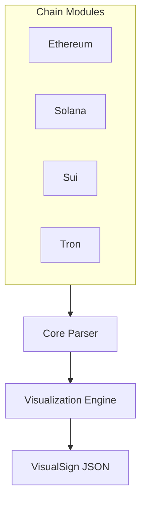

When users sign transactions, what they see depends on the wallet—not the DApp. There's no standard way for DApp developers to define how their transactions should be displayed, and existing solutions are chain-specific.

VisualSign is a cross-chain parser that lets DApp developers define transaction visualizations. Wallets integrate once and get support for Ethereum, Solana, Sui, Tron, and additional chains as they're added.

## Core Concept

VisualSign's power shows when parsing complex DeFi transactions. Here's a real Uniswap Universal Router transaction with multiple nested operations:

**Raw transaction (2470 characters of hex):**
```
0x02f904cf0181b78477359400847c17b3e383045307943fc91a3afd70395cd496c647d5a6cc9d4b2b7fad80b904a424856bc3...
```

**VisualSign output:**
```
┌─ Transaction: Ethereum Transaction
│  Version: 0
│  Type: EthereumTx
│
└─ Fields:
   ├─ Network: Ethereum Mainnet
   ├─ To: 0x3fC91A3afd70395Cd496C647d5a6CC9D4B2b7FAD
   ├─ Value: 0 ETH
   ├─ Gas Limit: 283399
   ├─ Gas Price: 2.081928163 gwei
   ├─ Max Priority Fee Per Gas: 2 gwei
   ├─ Nonce: 183
   └─ Universal Router
         Title: Uniswap Universal Router Execute
         Detail: 4 commands
         📖 Expanded View:
         ├─ Permit2 Permit
         │     Title: Permit2 Permit
         │     Detail: Permit 0x3fC91A3afd70395Cd496C647d5a6CC9D4B2b7FAD to spend Unlimited Amount of 0x72b658bd674f9c2b4954682f517c17d14476e417
         │     📖 Expanded View:
         │     ├─ Token: 0x72b658bd674f9c2b4954682f517c17d14476e417
         │     ├─ Amount: 1461501637330902918203684832716283019655932542975
         │     ├─ Spender: 0x3fc91a3afd70395cd496c647d5a6cc9d4b2b7fad
         │     ├─ Expires: 2025-12-15 18:44 UTC
         │     └─ Sig Deadline: 2025-11-15 19:14 UTC
         ├─ V2 Swap Exact In
         │     Title: V2 Swap Exact In
         │     Detail: Swap 46525180921656252477 0x72b658bd674f9c2b4954682f517c17d14476e417 for >=0.002761011377502728 WETH via V2 (1 hops)
         │     📖 Expanded View:
         │     ├─ Input Token: 0x72b658bd674f9c2b4954682f517c17d14476e417
         │     ├─ Input Amount: 46525180921656252477
         │     ├─ Output Token: WETH
         │     ├─ Minimum Output: >=0.002761011377502728
         │     └─ Hops: 1
         ├─ Pay Portion
         │     Title: Pay Portion
         │     Detail: Pay 0.2500% of WETH to 0x000000fee13a103A10D593b9AE06b3e05F2E7E1c
         │     📖 Expanded View:
         │     ├─ Token: WETH
         │     ├─ Percentage: 0.2500%
         │     └─ Recipient: 0x000000fee13a103a10d593b9ae06b3e05f2e7e1c
         └─ Unwrap WETH
               Title: Unwrap WETH
               Detail: Unwrap >=0.002754108849058971 WETH to ETH for 0x8419e7Eda8577Dfc49591a49CAd965a0Fc6716cF
               📖 Expanded View:
               ├─ Minimum Amount: >=0.002754108849058971 WETH
               └─ Recipient: 0x8419e7eda8577dfc49591a49cad965a0fc6716cf
```

This transforms an incomprehensible hex string into a clear, hierarchical representation that users can understand and verify before signing.

## Visualization philosophy

VisualSign follows these principles for creating transaction visualizations:

### 1. **Progressive disclosure**
Show the most important information first, with details available on demand.

```json
{
  "Type": "preview_layout",
  "PreviewLayout": {
    "Condensed": {
      "Fields": [/* Essential info */]
    },
    "Expanded": {
      "Fields": [/* All details */]
    }
  }
}
```

### 2. **Context-aware display**
Different transaction types get different visualizations:
- **Transfers**: Emphasize amount and recipient
- **Swaps**: Show token pairs and rates
- **Contract Calls**: Display method and parameters
- **NFT Operations**: Include metadata and previews

### 3. **Risk highlighting**
Critical information is prominently displayed:
- Large value transfers
- First-time recipients
- Contract interactions
- Irreversible operations

## Architecture



## Supported chains

Each blockchain has unique transaction structures requiring specialized parsing. See the chain-specific documentation for details:

- **[Ethereum](./chains/ethereum)** - Native transfers, ERC-20/721/1155 tokens, smart contracts, DeFi protocols
- **[Solana](./chains/solana)** - System/Token programs, multi-instruction transactions, account management
- **[Sui](./chains/sui)** - Object model, Move calls, programmable transactions
- **[Tron](./chains/tron)** - Energy/bandwidth system, TRC-20 tokens, TVM compatibility
- **Bitcoin** - Coming soon

## Next steps

- [Quickstart](./quickstart) - Test your DApp's transactions with the parser CLI
- [Creating Visualizations](./creating-visualizations) - Design patterns for transaction display
- [Chain Modules](./chain-modules) - Building parsers for specific blockchains
- [Field Types](./field-types) - VisualSign JSON field reference
- [Parser CLI](./parser-cli) - Command-line tool for development and testing
- [Vision & Roadmap](./vision-roadmap) - Long-term strategy for DApp integration

## Repositories

- [Transaction Parser](https://github.com/anchorageoss/visualsign-parser) - Core parser implementation
- [Attestation Verifier](https://github.com/anchorageoss/awsnitroverifier) - AWS Nitro attestation verification library
- [TurnKey Client](https://github.com/anchorageoss/visualsign-turnkeyclient) - Example client implementation
