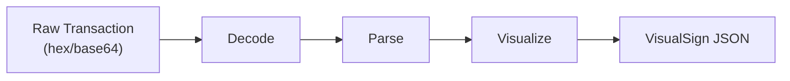

VisualSign transforms raw blockchain transactions into structured, human-readable descriptions. This page explains the parsing process independent of deployment model.

## The parsing pipeline



1. **Decode** — Deserialize the raw transaction bytes
2. **Parse** — Extract semantic meaning (amounts, addresses, function calls)
3. **Visualize** — Transform into VisualSign field types

## Input: Raw transactions

The parser accepts transactions in their native format:

| Chain | Input format | Encoding |
|-------|--------------|----------|
| Ethereum | RLP-encoded transaction | Hex |
| Solana | Serialized transaction | Base64 |
| Sui | BCS-encoded transaction | Base64 |
| Tron | Protobuf-encoded transaction | Hex |

## Output: VisualSign JSON

The parser returns a JSON structure with:

```typescript
interface TransactionData {
  Version: string;           // Format version
  Title: string;             // Transaction title (e.g., "Uniswap V3: Swap")
  Subtitle?: string;         // Optional subtitle
  Fields: Field[];           // Array of typed field objects
  ReplayProtection?: string; // Optional replay protection
}
```

Example output for an Ethereum transfer:

```json
{
  "Version": "0",
  "Title": "Ethereum Transaction",
  "Fields": [
    {
      "Type": "text_v2",
      "Label": "Network",
      "TextV2": { "Text": "Ethereum Mainnet" }
    },
    {
      "Type": "address_v2",
      "Label": "To",
      "AddressV2": { "Address": "0x3535353535353535353535353535353535353535" }
    },
    {
      "Type": "amount_v2",
      "Label": "Value",
      "AmountV2": { "Amount": "1", "Abbreviation": "ETH" }
    },
    {
      "Type": "text_v2",
      "Label": "Gas Limit",
      "TextV2": { "Text": "21000" }
    }
  ]
}
```

## Field types

VisualSign uses typed fields to represent different kinds of data:

| Type | Purpose | Example |
|------|---------|---------|
| `text_v2` | Labels, descriptions, numbers | "Ethereum Mainnet", "21000" |
| `amount_v2` | Token amounts with symbols | "1.5 ETH", "2847.32 USDC" |
| `address_v2` | Wallet/contract addresses | "0x1234..." |
| `preview_layout` | Grouped related fields | Swap details, transfer info |
| `list_layout` | Multiple items | NFT batch transfers, multi-send |

See [Field Types](/field-types) for complete documentation.

## Displaying to users

Parse the VisualSign JSON and render it in your UI:

```typescript
const visualSign = JSON.parse(visualSignJSON);

// Display transaction title
console.log(`Transaction: ${visualSign.Title}`);

// Render each field based on its type
visualSign.Fields.forEach(field => {
    switch(field.Type) {
        case 'text_v2':
            console.log(`${field.Label}: ${field.TextV2.Text}`);
            break;
        case 'amount_v2':
            console.log(`${field.Label}: ${field.AmountV2.Amount} ${field.AmountV2.Abbreviation}`);
            break;
        case 'address_v2':
            console.log(`${field.Label}: ${field.AddressV2.Address}`);
            break;
    }
});
```

## Condensed vs expanded output

VisualSign supports two display modes:

- **Condensed** — Essential fields only, designed for hardware wallet screens with limited display
- **Expanded** — Full transaction details for software wallets with more screen space

Both are included in the same response. Your UI decides which to display based on the device capabilities.

## Testing with the CLI

Use the parser CLI to test transaction parsing locally:

```bash
# Ethereum native transfer
cargo run --bin parser_cli -- --chain ethereum -o human \
  -t '0xf86c808504a817c800825208943535353535353535353535353535353535353535880de0b6b3a76400008025a028ef61340bd939bc2195fe537567866003e1a15d3c71ff63e1590620aa636276a067cbe9d8997f761aecb703304b3800ccf555c9f3dc64214b297fb1966a3b6d83'
```

Output:
```
┌─ Transaction: Ethereum Transaction
│  Version: 0
│  Type: EthereumTx
│
└─ Fields:
   ├─ Network: Ethereum Mainnet
   ├─ To: 0x3535353535353535353535353535353535353535
   ├─ Value: 1 ETH
   ├─ Gas Limit: 21000
   ├─ Gas Price: 20 gwei
   └─ Nonce: 0
```

CLI options:
- `-o json` — Output as JSON for programmatic use
- `-o human` — Human-readable tree format
- `--condensed-only` — Show only condensed fields
- `-n NETWORK` — Specify network (e.g., `POLYGON_MAINNET`)

See [Parser CLI](/parser-cli) for full documentation.

## Next steps

- [Chain Metadata](./chain-metadata) — Provide ABIs and IDLs for better parsing
- [Error Handling](./error-handling) — Handle parse failures gracefully
- [Field Types](/field-types) — Complete field type reference
