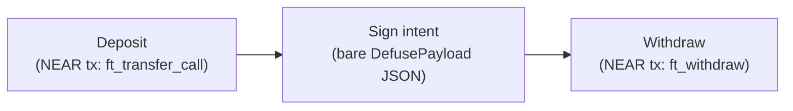

[NEAR Intents](https://docs.near-intents.org) (the Defuse Protocol) lets a user express *what* outcome they want — swap this for that, withdraw this asset — without picking a route, a bridge, or a DEX themselves. Solvers compete off-chain to fulfill the intent; settlement happens atomically inside the `intents.near` verifier contract.

Unlike an arbitrary Ethereum contract, NEAR Intents is a single, fixed protocol this parser already fully decodes: there's no ABI to provide and no custom decoder to contribute. This page is for anyone building signing UX around it — wallet integrators and dApp or solver-facing frontends alike — since the three flows below are all a user ever signs.

## The three flows

A user interacting with NEAR Intents signs at most three distinct kinds of payload. Only the middle one, the intent itself, uses the [pre-signature envelope](#the-intent-envelope-format); the other two are ordinary NEAR transactions.



### 1. Deposit — a NEAR transaction

Before a user can trade inside the verifier, they move an asset in. For a NEP-141 token already on NEAR (or a bridge-wrapped asset, e.g. `eth.omft.near` after bridging in from Ethereum), that's a `ft_transfer_call` on the token contract, with `receiver_id` set to `intents.near`:

```bash
cargo run --bin parser_cli -- decode --chain near --output json \
  -t <borsh-encoded-transaction-hex>
```

```json
{
  "Fields": [
    {
      "FallbackText": "NEAR Mainnet",
      "Label": "Network",
      "TextV2": { "Text": "NEAR Mainnet" },
      "Type": "text_v2"
    },
    {
      "AddressV2": { "Address": "alice.near" },
      "FallbackText": "alice.near",
      "Label": "From",
      "Type": "address_v2"
    },
    {
      "AddressV2": { "Address": "wrap.near" },
      "FallbackText": "wrap.near",
      "Label": "To",
      "Type": "address_v2"
    },
    {
      "FallbackText": "ft_transfer_call",
      "Label": "Method",
      "TextV2": { "Text": "ft_transfer_call" },
      "Type": "text_v2"
    },
    {
      "AddressV2": { "Address": "intents.near" },
      "FallbackText": "intents.near",
      "Label": "Recipient",
      "Type": "address_v2"
    },
    {
      "AmountV2": { "Abbreviation": "raw token units", "Amount": "1000000000000000000000000" },
      "FallbackText": "1000000000000000000000000 raw token units",
      "Label": "Amount",
      "Type": "amount_v2"
    },
    {
      "AmountV2": { "Abbreviation": "NEAR", "Amount": "0.000000000000000000000001" },
      "FallbackText": "0.000000000000000000000001 NEAR",
      "Label": "Deposit",
      "Type": "amount_v2"
    },
    {
      "FallbackText": "100 Tgas",
      "Label": "Gas",
      "TextV2": { "Text": "100 Tgas" },
      "Type": "text_v2"
    }
  ],
  "PayloadType": "NearTx",
  "Title": "Function Call",
  "Version": "0"
}
```

This is an ordinary `CHAIN_NEAR` transaction like any other `FunctionCall` — nothing intents-specific about the request or response shape. The `Recipient` field resolves because `ft_transfer_call` is one of the three methods the parser understands the args of; its `Amount` always renders in raw base units on this path (this args decoder does not attempt token resolution) — resolution to a symbol like `wNEAR` only happens for the intents preset's own fields (see [NEAR](/chains/near#visualization-strategy)).

### 2. Sign the intent — the pre-signature envelope

Once inside the verifier, the user expresses a trade as an intent — most commonly `token_diff`, a batch of "give this, receive that" deltas that must sum to zero per token across the whole batch. The user signs the **bare envelope**, before it's wrapped in any signature standard:

```bash
cargo run --bin parser_cli -- decode --chain near --output json \
  -t '{"signer_id":"alice.near","verifying_contract":"intents.near","deadline":"2100-01-01T00:00:00Z","nonce":"XVoKfmScb3G+XqH9ke/fSlJ/3xO59sNhCxhpG821BH8=","intents":[{"intent":"ft_withdraw","token":"wrap.near","receiver_id":"bob.near","amount":"1000000000000000000000000"}]}'
```

```json
{
  "Fields": [
    {
      "FallbackText": "alice.near",
      "Label": "Signer",
      "TextV2": { "Text": "alice.near" },
      "Type": "text_v2"
    },
    {
      "FallbackText": "intents.near",
      "Label": "Verifying Contract",
      "TextV2": { "Text": "intents.near" },
      "Type": "text_v2"
    },
    {
      "FallbackText": "2100-01-01T00:00:00+00:00",
      "Label": "Deadline",
      "TextV2": { "Text": "2100-01-01T00:00:00+00:00" },
      "Type": "text_v2"
    },
    {
      "FallbackText": "0x5d5a0a7e649c6f71be5ea1fd91efdf4a527fdf13b9f6c3610b18691bcdb5047f",
      "Label": "Nonce",
      "TextV2": { "Text": "0x5d5a0a7e649c6f71be5ea1fd91efdf4a527fdf13b9f6c3610b18691bcdb5047f" },
      "Type": "text_v2"
    },
    {
      "FallbackText": "wrap.near",
      "Label": "Token",
      "TextV2": { "Text": "wrap.near" },
      "Type": "text_v2"
    },
    {
      "FallbackText": "bob.near",
      "Label": "To",
      "TextV2": { "Text": "bob.near" },
      "Type": "text_v2"
    },
    {
      "AmountV2": { "Abbreviation": "wNEAR", "Amount": "1" },
      "FallbackText": "1 wNEAR",
      "Label": "Amount",
      "Type": "amount_v2"
    }
  ],
  "PayloadType": "NearTx",
  "Title": "NEAR Intent",
  "Version": "0"
}
```

(The example above uses a `ft_withdraw` intent for brevity; a `token_diff` swap renders one `Send`/`Receive` amount field per token in the diff, plus the same `Signer`/`Verifying Contract`/`Deadline`/`Nonce` envelope fields.)

Send this same input under `chain: CHAIN_NEAR` — the parser identifies it as an envelope, not a transaction, because the input is JSON rather than borsh (see [format discrimination](/chains/near#two-input-formats-one-chain-identity)). No signature exists yet at this stage, so nothing renders for it.

#### What happens after signing

Your wallet's job ends at this render. The signed envelope is wrapped in one of seven signature standards depending on the user's key type — **NEP-413** or **raw ed25519** for a NEAR-style key, **ERC-191** for an EVM-style key, and so on for TIP-191, WebAuthn, TonConnect, and SEP-53 — then handed to solvers, never submitted by the wallet itself. If your wallet later needs to *display* an already-signed batch (for audit or support purposes), that's the `execute_intents` decode path: sending the batch as a NEAR `FunctionCall` to `intents.near` under `CHAIN_NEAR` renders every signed entry with its verification status, using the same envelope fields as above plus a `Standard` and `Signature` line per entry.

### 3. Withdraw — a NEAR transaction

Exiting settles back to an ordinary NEAR transaction: a `ft_withdraw` call on the verifier itself (`intents.near`), not on the token contract. This renders through the same generic `FunctionCall` args decoder as the deposit above — no intents-specific handling needed, since a withdraw transaction carries no envelope.

## The intent envelope format

Every intent, regardless of which signature standard wraps it, shares one envelope shape:

```json
{
  "signer_id": "<implicit or named NEAR account>",
  "verifying_contract": "intents.near",
  "deadline": "<RFC3339 timestamp>",
  "nonce": "<base64, 32 bytes>",
  "intents": [ { "intent": "<type>", "...": "..." } ]
}
```

A single envelope can carry a batch — `intents` is an array, and the verifier executes the whole batch atomically: either every intent succeeds, or the batch aborts and nothing changes. See [NEAR](/chains/near#supported-intent-types) for the full table of intent types the parser renders.

## Implicit accounts

`signer_id` is often not a named NEAR account (`alice.near`) but an **implicit** one: a 64-character hex string for an ed25519 key, or an EVM-style `0x…` address for a secp256k1 key. Implicit accounts require no registration — the account exists the moment its derivation from a public key is known, and the verifier accepts the first signed intent under it directly. A user signing with a NEAR-style key and an EVM-style key holds two independent, unlinked identities on `intents.near`; balances and history don't carry over between them.

## Verify what users will see

Render both the deposit/withdraw transaction and the intent envelope locally before shipping:

```bash
cargo run --bin parser_cli -- decode --chain near --output human -t <input>
```

The `human` output is what your wallet's user sees; `json` is the exact `SignablePayload` your UI renders. See [Parser CLI](/parser-cli) for the full set of flags.

## Next steps

- [NEAR](/chains/near): The full intent-type table, signature standards, and visualization strategy.
- [Field Types](/field-types): The complete `SignablePayload` schema.
- [Parser CLI](/parser-cli): The local rendering loop in detail.
