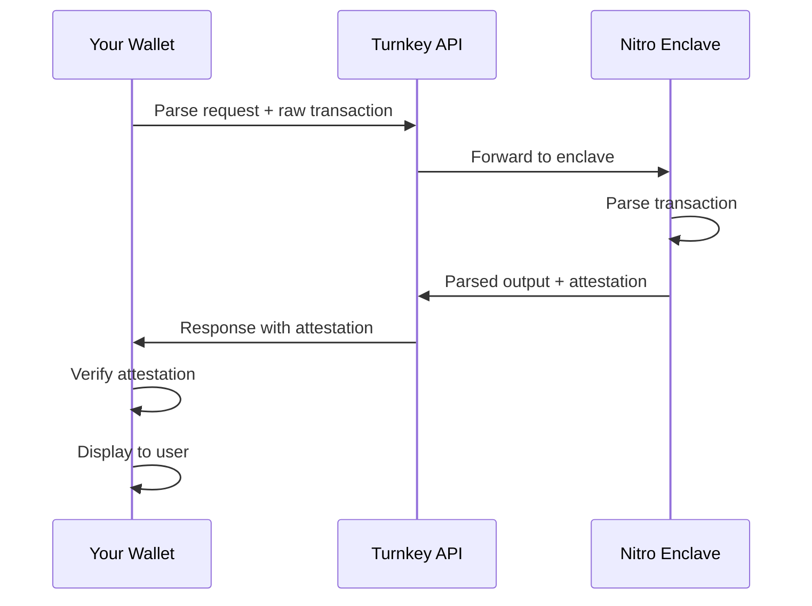

{/*
TODO: Fill in when Turnkey integration details are available.
*/}

Turnkey operates VisualSign parser instances in AWS Nitro Enclaves, providing transaction parsing with attestation verification without requiring you to manage enclave infrastructure.

## Prerequisites

- Turnkey account with API credentials
- Understanding of [attestation verification](../self-hosted-tee/attestation)

## Integration overview

## Getting started

<Note>
Integration details coming soon. Contact Turnkey for early access.
</Note>

## Attestation verification

Even with a hosted solution, you must verify attestations. The attestation document proves:

1. The response came from a genuine AWS Nitro Enclave
2. The enclave is running the expected VisualSign parser code
3. The parsed output hasn't been tampered with

See [Attestation Verification](../self-hosted-tee/attestation) for implementation details.

## API reference

The hosted API uses the same gRPC interface as self-hosted deployments. See [gRPC API Reference](../../api-reference) for message formats and examples.

## Support

- [Turnkey Documentation](https://docs.turnkey.com)
- [GitHub Issues](https://github.com/anchorageoss/visualsign-parser/issues)
