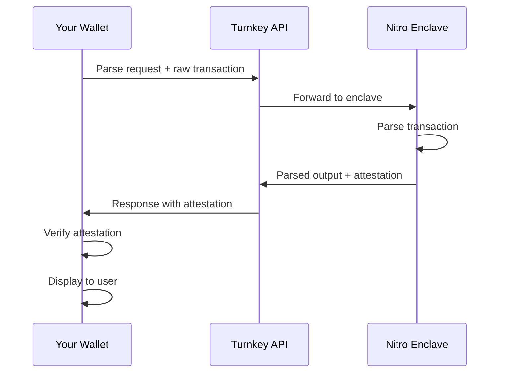

Turnkey operates VisualSign parser instances in AWS Nitro Enclaves, providing transaction parsing with attestation verification without requiring you to manage enclave infrastructure.

## Prerequisites

- Turnkey account with API credentials.
- Understanding of [attestation verification](../self-hosted-tee/attestation).

## Integration overview


```mermaid
sequenceDiagram
    participant W as Your Wallet
    participant T as Turnkey API
    participant E as Nitro Enclave

    W->>T: Parse request + raw transaction
    T->>E: Forward to enclave
    E->>E: Parse transaction
    E->>T: Parsed output + attestation
    T->>W: Response with attestation
    W->>W: Verify attestation
    W->>W: Display to user
```

## Attestation verification

Every parse response carries an AWS Nitro attestation document. To trust the parsed output you must:

1. Verify the attestation's certificate chain back to the AWS Nitro root CA.
2. Check the document's PCR values against an allowlist you control.
3. Verify the parser's ECDSA signature over the parsed payload using the public key from the attestation.

See [Attestation Verification](../self-hosted-tee/attestation) for implementation details of all three steps. The remainder of this page covers (2) — specifically, how to obtain the PCR values you should put in your allowlist.

## PCR allowlist values

The PCRs are determined by the qos enclave runtime version Turnkey has deployed (currently TVC `v2026.6.11`, qos commit [`3e4d73c4d2b9bb270c457bf7eae2e76a7f420998`](https://github.com/tkhq/qos/commit/3e4d73c4d2b9bb270c457bf7eae2e76a7f420998)). You can reproduce them locally from that qos rev — never trust an externally supplied PCR file without verifying it.

### Generating PCRs from source

The `scripts/extract-nitro-pcrs.sh` tool in this repo clones tkhq/qos at the deployment rev declared in `src/Cargo.toml`, builds `qos_enclave`, and extracts `/nitro.pcrs`:

```bash
./scripts/extract-nitro-pcrs.sh
```

The deployment rev lives in a marker comment in `src/Cargo.toml`:

```toml
# qos-deployment-rev = 3e4d73c4d2b9bb270c457bf7eae2e76a7f420998
```

This is distinct from the `rev = "..."` on each `qos_*` crate in the same file, which pins the qos library code that `parser_app` compiles against and does not affect PCRs. To audit a prospective deployment bump before updating the marker, pass `--rev` explicitly:

```bash
./scripts/extract-nitro-pcrs.sh --rev <40-char-qos-sha>
```

#### Prerequisites

- Docker 26+
- Git and GNU Make
- ~8 GB of free RAM and ~15 GB of free disk (StageX base images, a clean cargo compile, and the qos OCI output).

#### Options

| Flag | Default | Purpose |
| --- | --- | --- |
| `--cargo-toml PATH` | `src/Cargo.toml` | Source of the deployment-rev marker. |
| `--qos-dir PATH` | `mktemp -d` | qos checkout location. The default is ephemeral and removed on exit; pass an explicit path to keep cached cargo and docker layers between runs. The script verifies the directory's `origin` URL matches `tkhq/qos` before mutating it. |
| `--output PATH` | `out/nitro.pcrs` | Where to write the PCRs file. |
| `--skopeo-image REF` | digest-pinned `quay.io/skopeo/stable` | Container image used to convert the OCI layout to a docker-loadable tar (no host `skopeo` install needed). |
| `--rev REV` | (from `Cargo.toml` marker) | Override the rev. |

#### How it works

1. **Read the rev** — the script extracts a 40-character hex from the `# qos-deployment-rev = ...` line in `src/Cargo.toml`. If `--rev` is supplied it bypasses this step.
2. **Check out qos** — clones `tkhq/qos` into the work dir and checks out the rev. If `--qos-dir` points at an existing clone whose `origin` is the upstream `tkhq/qos` URL and whose `HEAD` already matches the rev, the script reuses it; if the origin differs the script refuses to touch the directory.
3. **Build `qos_enclave`** — runs `make out/qos_enclave/index.json` inside the qos checkout. This is qos's deterministic [StageX](https://codeberg.org/stagex/stagex)-based build: it produces a `nitro.eif` and `nitro.pcrs` via `eif_build` and bakes them into the OCI image. The full pipeline lives in qos's [`qos_enclave` Containerfile](https://github.com/tkhq/qos/blob/main/src/images/qos_enclave/Containerfile).
4. **Extract `nitro.pcrs`** — runs the pinned skopeo image (as your host user, so the staging files clean up) to convert the OCI directory output to a docker-archive tar, loads it under a unique per-run tag, copies `/nitro.pcrs` out of a freshly created container, and removes both the container and the image on exit.

#### What the PCRs measure

PCR0 and PCR1 measure the Nitro EIF and kernel, and PCR2 measures the boot ramdisk that contains qos's `init` binary. The `parser_app` binary is loaded into qos at runtime over vsock and is **not** part of these PCR measurements — its integrity is established separately via the qos manifest, which is covered at [Level 3 attestation](../self-hosted-tee/attestation#level-3-manifest-verification). PCR3 in a live attestation measures the AWS IAM role and is intentionally absent from `nitro.pcrs`.

### Cross-checking against a live prod attestation

You can confirm the locally built PCRs match what the production enclave actually serves by fetching a fresh attestation through [visualsign-turnkeyclient](https://github.com/anchorageoss/visualsign-turnkeyclient).

```bash
# 1. Build the client
git clone https://github.com/anchorageoss/visualsign-turnkeyclient.git
cd visualsign-turnkeyclient
go build -o ./bin/visualsign-turnkeyclient .

# 2. Fetch a real prod attestation and print PCRs (any well-formed unsigned
#    tx works — the parser returns the same enclave attestation regardless).
./bin/visualsign-turnkeyclient verify \
  --host https://api.turnkey.com \
  --organization-id <your-org-id> \
  --key-name <your-turnkey-api-key> \
  --chain CHAIN_ETHEREUM \
  --unsigned-payload <hex-or-base64-tx> \
  --debug 2>&1 | grep -E '^[[:space:]]+PCR\[[012]\]'

# 3. Compare against the script output.
./scripts/extract-nitro-pcrs.sh --output /tmp/local.pcrs
cat /tmp/local.pcrs
```

If both sets of PCR0/PCR1/PCR2 hex values match, the local build reproduces the deployed runtime byte for byte.

## Reproducibility

The qos build is deterministic. Running the script twice should produce byte-identical `nitro.pcrs` files. Pass `--qos-dir` to the second run so the cargo and docker layer caches are reused — the second build should be a no-op:

```bash
./scripts/extract-nitro-pcrs.sh --output /tmp/pcrs.a --qos-dir /tmp/qos
./scripts/extract-nitro-pcrs.sh --output /tmp/pcrs.b --qos-dir /tmp/qos
diff /tmp/pcrs.a /tmp/pcrs.b
```

If the diff is empty, the build reproduced.

## API reference

The hosted API uses the same gRPC interface as self-hosted deployments. See [gRPC API Reference](../../api-reference) for message formats and examples.

## Support

- [Turnkey Documentation](https://docs.turnkey.com)
- [GitHub Issues](https://github.com/anchorageoss/visualsign-parser/issues)
