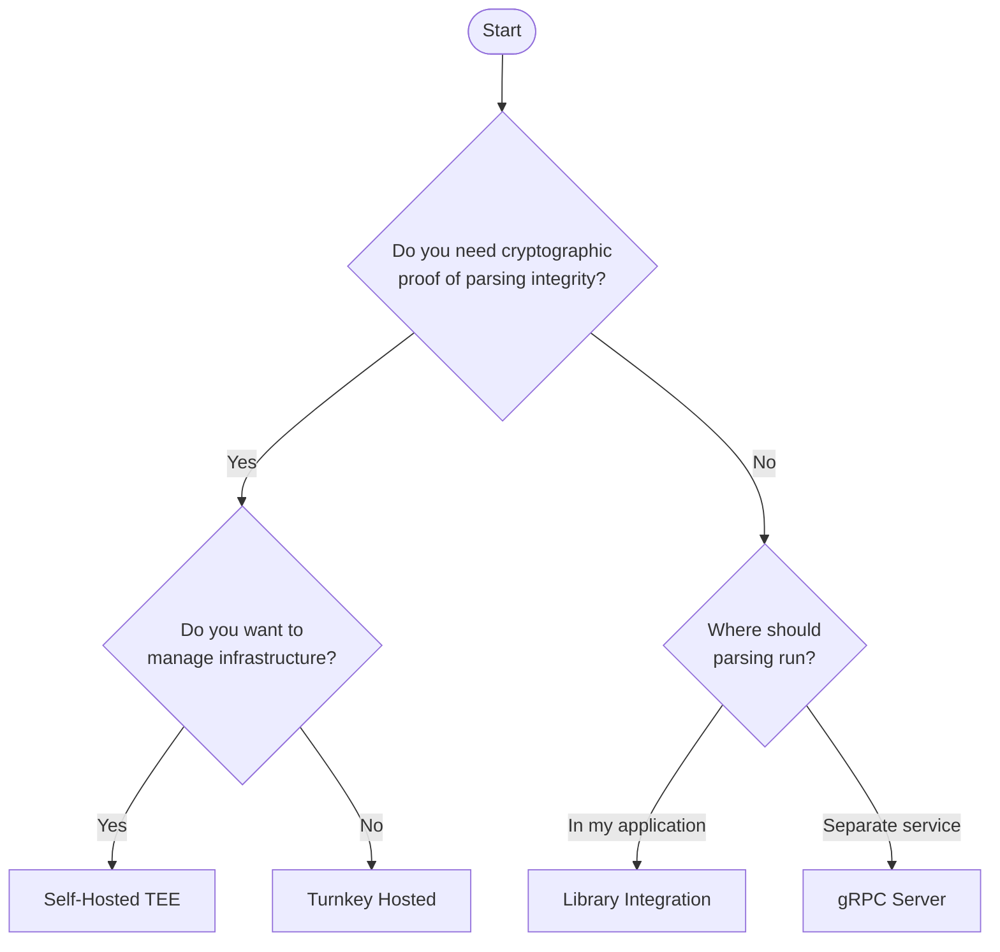

VisualSign can be deployed in several ways, each with different trade-offs around security guarantees, infrastructure requirements, and integration complexity. This guide helps you choose the right approach.

## Decision tree

## Comparison

| | Turnkey Hosted | Self-Hosted TEE | Library | gRPC Server |
|---|---|---|---|---|
| **Security model** | Attestation-verified TEE | Attestation-verified TEE | Trust your process | Trust your network |
| **Parsing integrity proof** | Yes | Yes | No | No |
| **Infrastructure** | Managed | You manage AWS Nitro | None | Container/process |
| **Network dependency** | Yes (Turnkey API) | Yes (your enclave) | No | Yes (localhost/internal) |
| **Latency** | Network round-trip | Network round-trip | In-process | Local network |
| **Best for** | Production wallets | Enterprises with compliance requirements | Browser extensions, embedded systems | Internal services, development |

## Deployment models

### Turnkey Hosted

Turnkey operates the VisualSign parser in AWS Nitro Enclaves. You send transactions to their API and verify the attestation documents they return.

**You handle:**
- Calling the Turnkey API
- Verifying attestation documents
- Displaying parsed output to users

**Turnkey handles:**
- Enclave infrastructure
- Scaling and availability
- Enclave updates and PCR management

[Get started with Turnkey Hosted →](./hosted/getting-started)

---

### Self-Hosted TEE

Run the VisualSign parser in your own AWS Nitro Enclaves. You have full control over the infrastructure and can customize the deployment to your needs.

**You handle:**
- AWS Nitro Enclave infrastructure
- Enclave deployment and updates
- PCR allowlist management
- Scaling and availability

**Best for:**
- Organizations with strict compliance requirements
- Use cases requiring air-gapped or private deployments
- Custom attestation verification workflows

[Get started with Self-Hosted TEE →](./self-hosted-tee/getting-started)

---

### Library Integration

Embed the VisualSign parser directly in your application. Available as Rust crates that can be compiled into your application.

**Trade-offs:**
- No attestation (you trust your own process)
- No network latency
- Smallest deployment footprint

[Get started with Library Integration →](./library/getting-started)

---

### gRPC Server

Run the gRPC parser service without TEE infrastructure. The same gRPC API as the TEE deployments, but without enclave isolation or attestation.

**Use cases:**
- Development and testing
- Internal services on trusted networks
- Environments where TEE isn't available

**Trade-offs:**
- No attestation verification
- Relies on network security
- Same API as TEE deployments (easy migration path)

[Get started with gRPC Server →](./grpc-server/getting-started)

---

## Security considerations

### When you need attestation

Attestation provides cryptographic proof that:
1. The parser code hasn't been tampered with
2. The parsing happened inside a secure enclave
3. The output hasn't been modified

**You should use a TEE deployment (Hosted or Self-Hosted) when:**
- Users are signing high-value transactions
- Regulatory requirements mandate tamper-evident processing
- You need to prove parsing integrity to auditors or users

### When attestation isn't required

**Library or gRPC Server deployments are appropriate when:**
- Parsing happens on the user's own device (browser extension, mobile app)
- The service runs on internal infrastructure you fully control
- You're building development or testing environments
- The threat model doesn't include compromised parsing infrastructure

## Next steps

Choose your deployment model and follow the getting started guide:

- [Turnkey Hosted](./hosted/getting-started) — Fastest path to production
- [Self-Hosted TEE](./self-hosted-tee/getting-started) — Full control with TEE security
- [Library Integration](./library/getting-started) — Embed parsing directly
- [gRPC Server](./grpc-server/getting-started) — Simple gRPC service

Regardless of deployment model, you'll want to understand:
- [How parsing works](./core-concepts/how-parsing-works) — Transaction input and VisualSign output
- [Chain metadata](./core-concepts/chain-metadata) — Providing ABIs and IDLs
- [Error handling](./core-concepts/error-handling) — Handling parse failures gracefully
