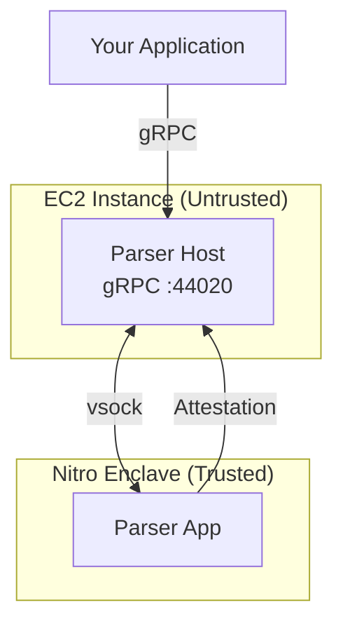

{/*
PLACEHOLDER - This page is not yet in navigation.
TODO: Expand with detailed deployment instructions.
*/}

Run the VisualSign parser in AWS Nitro Enclaves on your own infrastructure. This gives you full control over the deployment while maintaining cryptographic attestation guarantees.

## Prerequisites

- AWS account with Nitro Enclave-capable EC2 instances
- Familiarity with EIF (Enclave Image File) deployment
- Understanding of PCR-based attestation

## Architecture



## Deployment steps

### 1. Build the enclave image

```bash
# Clone the repository
git clone https://github.com/anchorageoss/visualsign-parser
cd visualsign-parser

# Build the EIF
# TODO: Add specific build commands
```

### 2. Launch EC2 with enclave support

Launch an enclave-capable instance (e.g., `m5.xlarge` or larger with `--enclave-options 'Enabled=true'`).

### 3. Start the enclave

```bash
# TODO: Add nitro-cli commands
```

### 4. Configure the parser host

The parser host runs outside the enclave and proxies gRPC requests over vsock.

```bash
# TODO: Add host configuration
```

## Verifying your deployment

After deployment, verify the enclave is running correctly:

```bash
# Check enclave status
nitro-cli describe-enclaves

# Test parsing
grpcurl -plaintext localhost:44020 parser.ParserService/Parse
```

## PCR management

Platform Configuration Registers (PCRs) identify your enclave build. You'll need to:

1. Record PCR values after building
2. Distribute PCR allowlists to clients
3. Update allowlists when you deploy new versions

See [Attestation](./attestation) for PCR verification implementation.

## Next steps

- [Security Model](./security-model) — Understand the TEE threat model
- [Attestation](./attestation) — Implement attestation verification
- [Operations](./operations) — Scaling, monitoring, and updates
