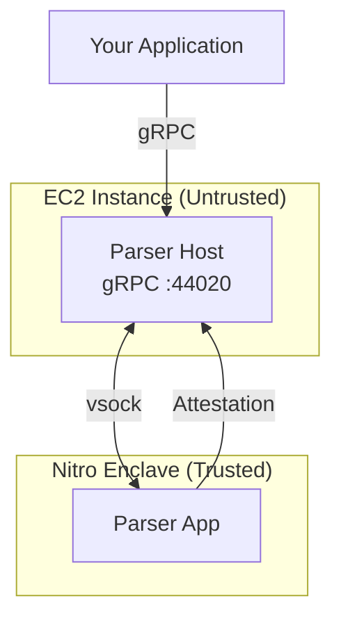

Run the VisualSign parser in AWS Nitro Enclaves on your own infrastructure. This gives you full control over the deployment while maintaining cryptographic attestation guarantees.

## Prerequisites

- AWS account with Nitro Enclave-capable EC2 instances (e.g., `m5.xlarge`, `c5.xlarge`, or larger)
- Docker with BuildKit support
- `nitro-cli` installed on the EC2 instance
- Familiarity with AWS Nitro Enclaves concepts

## Architecture



The system has two components:
- **Parser Host** — Runs on the EC2 instance, exposes gRPC API, forwards requests to enclave via vsock
- **Parser App** — Runs inside the Nitro Enclave, performs parsing, signs responses

## Build the container images

Clone the repository and build the OCI images:

```bash
git clone https://github.com/anchorageoss/visualsign-parser
cd visualsign-parser

# Build parser_app (runs inside enclave)
docker buildx build \
    --load \
    --tag visualsign-parser/parser_app \
    -f images/parser_app/Containerfile .

# Build parser_host (runs on EC2 host)
docker buildx build \
    --load \
    --tag visualsign-parser/parser_host \
    -f images/parser_host/Containerfile .
```

The builds use [StageX](https://stagex.tools) base images for reproducibility. The binaries are statically linked against musl libc.

## Create the Enclave Image File (EIF)

On your Nitro-capable EC2 instance, convert the parser_app container to an EIF:

```bash
# Save the Docker image to a tar file
docker save visualsign-parser/parser_app -o parser_app.tar

# Build the EIF
nitro-cli build-enclave \
    --docker-uri visualsign-parser/parser_app \
    --output-file parser_app.eif
```

This outputs the EIF file and **PCR values** — save these, you'll need them for attestation verification:

```
Enclave Image successfully created.
{
  "Measurements": {
    "HashAlgorithm": "Sha384 { ... }",
    "PCR0": "7fb5c55bc2ecbb68ed99a13d7122abfc0666b926...",
    "PCR1": "235c9e6050abf6b993c915505f3220e2a82b51a4...",
    "PCR2": "0f0e3e8118b61c8c5b21f92e1e2e52e89d09a92c..."
  }
}
```

## Launch the enclave

Start the enclave with appropriate resource allocation:

```bash
nitro-cli run-enclave \
    --eif-path parser_app.eif \
    --cpu-count 2 \
    --memory 512 \
    --enclave-cid 16
```

The `--enclave-cid` is the Context ID used for vsock communication. Choose a value between 4 and 2^32-1 (3 is reserved).

Verify the enclave is running:

```bash
nitro-cli describe-enclaves
```

Expected output:
```json
[
  {
    "EnclaveID": "i-xxx-enc-yyy",
    "EnclaveCID": 16,
    "State": "RUNNING",
    "Flags": "NONE",
    ...
  }
]
```

## Start the parser host

Run the parser host on the EC2 instance, connecting to the enclave via vsock:

```bash
# Extract the parser_host binary from the container
docker create --name temp visualsign-parser/parser_host
docker cp temp:/usr/local/bin/parser_host ./parser_host
docker rm temp

# Start the host
./parser_host \
    --host-ip 0.0.0.0 \
    --host-port 44020 \
    --cid 16 \
    --port 5000 \
    --metrics \
    --metrics-port 44021
```

CLI options:
- `--host-ip` — IP to listen on for gRPC clients
- `--host-port` — Port for gRPC (default: 44020)
- `--cid` — Enclave Context ID (must match `--enclave-cid` from run-enclave)
- `--port` — vsock port the enclave listens on
- `--metrics` — Enable Prometheus metrics endpoint
- `--metrics-port` — Port for metrics (default: 44021)

## Verify the deployment

Test that parsing works end-to-end:

```bash
# Check enclave status
nitro-cli describe-enclaves

# Health check
grpcurl -plaintext localhost:44020 grpc.health.v1.Health/Check

# Test parsing an Ethereum transaction
grpcurl -plaintext -d '{
  "unsigned_payload": "0xf86c808504a817c800825208943535353535353535353535353535353535353535880de0b6b3a76400008025a028ef61340bd939bc2195fe537567866003e1a15d3c71ff63e1590620aa636276a067cbe9d8997f761aecb703304b3800ccf555c9f3dc64214b297fb1966a3b6d83",
  "chain": "CHAIN_ETHEREUM"
}' localhost:44020 parser.ParserService/Parse
```

## PCR management

Platform Configuration Registers (PCRs) identify your enclave build. Distribute these to clients for attestation verification.

### Recording PCRs

After building the EIF, record the PCR values from `nitro-cli build-enclave` output. Store them in a version-controlled allowlist:

```yaml
# pcr-allowlist.yaml
visualsign-parser:
  version: "1.0.0"
  measurements:
    pcr0: "7fb5c55bc2ecbb68ed99a13d7122abfc0666b926..."
    pcr1: "235c9e6050abf6b993c915505f3220e2a82b51a4..."
    pcr2: "0f0e3e8118b61c8c5b21f92e1e2e52e89d09a92c..."
```

### Updating PCRs

When you deploy a new version:

1. Build the new EIF and record PCR values
2. Add new PCRs to the allowlist
3. Notify clients to update their allowlists
4. Deploy the new enclave
5. After migration, remove old PCRs

## Running as a systemd service

For production, run the host as a systemd service:

```ini
# /etc/systemd/system/visualsign-host.service
[Unit]
Description=VisualSign Parser Host
After=network.target nitro-enclaves-allocator.service

[Service]
Type=simple
ExecStart=/usr/local/bin/parser_host \
    --host-ip 0.0.0.0 \
    --host-port 44020 \
    --cid 16 \
    --port 5000 \
    --metrics \
    --metrics-port 44021
Restart=always
RestartSec=5

[Install]
WantedBy=multi-user.target
```

Enable and start:

```bash
sudo systemctl enable visualsign-host
sudo systemctl start visualsign-host
```

## Troubleshooting

### Enclave won't start

Check resource allocation:
```bash
# View enclave allocator settings
cat /etc/nitro_enclaves/allocator.yaml

# Ensure enough memory and CPUs are reserved
```

### Connection refused on vsock

Verify CID matches between host and enclave:
```bash
nitro-cli describe-enclaves | jq '.[0].EnclaveCID'
```

### Attestation failures

Verify PCR values match your allowlist:
```bash
nitro-cli describe-enclaves | jq '.[0].Measurements'
```

## Next steps

- [Security Model](./security-model) — Understand the TEE threat model
- [Attestation](./attestation) — Implement attestation verification
- [gRPC API Reference](/api-reference) — Full API documentation
