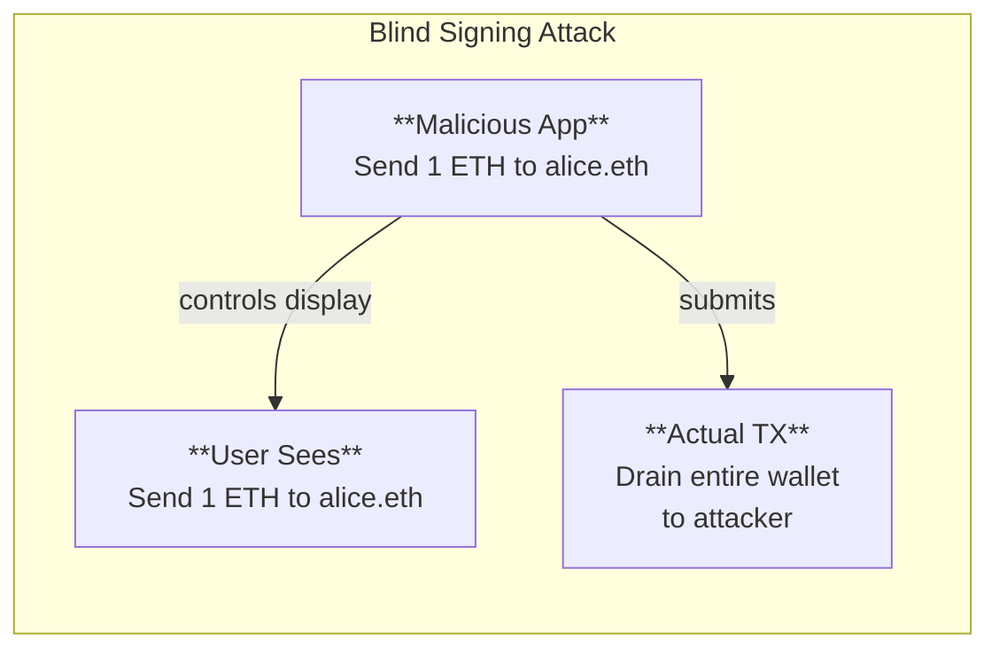
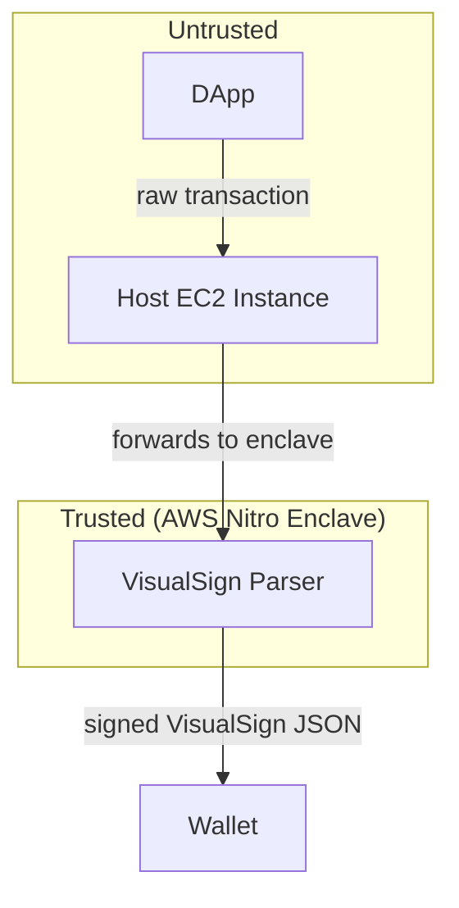

VisualSign solves a fundamental problem in blockchain security: users cannot verify what they are signing. This page explains the threat model, trust architecture, and security guarantees that VisualSign provides when deployed in AWS Nitro Enclaves.

## The problem

When you sign a blockchain transaction, you typically see one of two things:

1. **Raw hex data** — Incomprehensible strings like `0xf86c808504a817c800...`
2. **Application-provided descriptions** — Text that could be manipulated by a compromised app

Both approaches are vulnerable:



The application controls what the user sees, so a compromised or malicious application can show misleading information while the actual transaction does something different.

## VisualSign's solution

VisualSign moves transaction parsing into a Trusted Execution Environment (TEE) that the application can't manipulate and the wallet can trust.



## Trust architecture

### What you trust

| Component | Trust Basis |
|-----------|-------------|
| AWS Nitro hardware | Physical security and AWS's security practices |
| Enclave code | Open-source, auditable, measured at boot |
| Cryptographic primitives | Standard algorithms (P256 ECDSA, SHA-256) |

### What you don't need to trust

| Component | Why |
|-----------|-----|
| The application | It only submits raw bytes; it cannot influence parsing |
| The network | Attestation verification catches any tampering |
| The host EC2 instance | The enclave isolates parsing from the host system |

## AWS Nitro Enclaves

VisualSign runs inside [AWS Nitro Enclaves](https://aws.amazon.com/ec2/nitro/nitro-enclaves/), which provide hardware-level isolation. A Nitro Enclave is a separate virtual machine that runs alongside a host EC2 instance. The enclave has its own kernel and memory, which the host instance cannot access—even though the host is responsible for starting and stopping the enclave.

### Key properties

1. **Isolated execution** — The enclave runs in a separate virtual machine with its own kernel. The parent instance cannot access enclave memory.

2. **No persistent storage** — Enclaves have no disk access. All state exists only in memory and is lost on restart.

3. **No external network** — Enclaves cannot make network calls directly. All communication goes through a controlled vsock channel.

4. **Cryptographic attestation** — AWS signs a document containing measurements of exactly what code is running.

### Platform Configuration Registers (PCRs)

PCRs are cryptographic measurements taken at boot time:

| PCR | Contents |
|-----|----------|
| PCR0 | Hash of the enclave image file |
| PCR1 | Hash of the Linux kernel and boot ramfs |
| PCR2 | Hash of the application binary |
| PCR3 | Hash of the IAM role assigned to the parent instance |
| PCR4 | Hash of the instance ID |
| PCR8 | Hash of the enclave signing certificate |

By verifying PCR values, you can confirm the exact code running in the enclave.

## End-to-end security flow

### 1. Transaction submission

The application submits raw transaction bytes to the parser service. The application cannot include any metadata that would influence how the transaction is displayed.

```go
request := &ParseRequest{
    UnsignedPayload: "0xf86c808504a817c800...", // Raw bytes only
    Chain: CHAIN_ETHEREUM,
}
```

### 2. Isolated parsing

Inside the enclave, the parser:
- Decodes the raw transaction using chain-specific logic
- Extracts human-readable information (amounts, addresses, methods)
- Generates the VisualSign JSON representation

The parsing code is deterministic. The same input always produces the same output.

### 3. Signing

The enclave signs the parsed output using a private key that exists only inside the enclave:

```
SignedOutput = Sign(PrivateKey, Hash(VisualSignJSON))
```

The private key is generated inside the enclave and never leaves it.

### 4. Attestation

AWS Nitro signs an attestation document containing:
- The enclave's public key
- PCR measurements proving what code is running
- A timestamp and nonce for freshness

### 5. Verification

The wallet verifies before displaying:

1. **Certificate chain** — Validates the attestation document was signed by AWS
2. **PCR values** — Confirms the expected parser code is running
3. **Signature** — Verifies the parsed output was signed by the attested enclave

Only after all checks pass does the wallet display the visualization.

## Cryptographic guarantees

### Signature scheme

VisualSign uses P256 ECDSA for signing parsed transactions:

- **Algorithm**: ECDSA with NIST P-256 curve
- **Hash**: SHA-256
- **Key generation**: Inside the enclave at startup

### Attestation verification

Attestation documents use:

- **Format**: CBOR-encoded COSE Sign1
- **Certificate chain**: X.509 certificates rooted at AWS Nitro CA
- **Freshness**: Timestamp and optional nonce

## Threat model

### Attacks VisualSign prevents

| Attack | How VisualSign Prevents It |
|--------|---------------------------|
| **Malicious app displays fake transaction** | Wallet only trusts attested parser output |
| **Man-in-the-middle modifies parsed output** | Signature verification detects tampering |
| **Compromised host EC2 instance** | Enclave isolation prevents host access |
| **Replay of old parsed transactions** | Attestation timestamp and nonce provide freshness |

### Attacks outside scope

| Attack | Why It's Out of Scope |
|--------|----------------------|
| **User approves without reading** | VisualSign displays information; users must review it |
| **Correct but malicious transaction** | If the transaction does what it says, that's the user's decision |
| **Compromised wallet software** | The wallet must correctly implement verification |
| **AWS infrastructure compromise** | VisualSign relies on AWS Nitro security |

### Assumptions

VisualSign's security model assumes:

1. AWS Nitro Enclaves provide the isolation properties AWS claims
2. The cryptographic algorithms used are secure
3. The wallet correctly implements attestation verification
4. Users review the displayed information before signing

## Implementation considerations

### For wallet developers

1. **Always verify attestation** — Never display parsed output without full verification
2. **Maintain PCR allowlists** — Keep track of valid parser versions
3. **Handle verification failures** — If verification fails, do not display the parsed output

### For security auditors

Key areas to review:

- Attestation verification implementation
- PCR allowlist management
- Certificate chain validation
- Signature verification logic

### PCR management

When the parser is updated, PCR values change. Wallets should:

1. Subscribe to parser release announcements
2. Verify new PCR values against published hashes
3. Update allowlists before new versions are deployed
4. Support multiple PCR sets during migration periods

## Next steps

- [Attestation Verification](./attestation) — Implementation guide
- [Getting Started](./getting-started) — Deploy your own enclave
- [Parser Source Code](https://github.com/anchorageoss/visualsign-parser)

## Resources

- [AWS Nitro Enclaves Documentation](https://docs.aws.amazon.com/enclaves/)
- [VisualSign Verifier Library](https://github.com/anchorageoss/awsnitroverifier)
