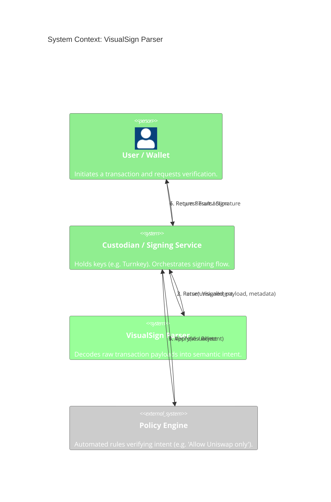

# Context Diagram (C4 Level 1)

This diagram illustrates the high-level interaction between external systems and the VisualSign Parser.

## Legend

-   **User/Wallet**: The end-user or dApp proposing a transaction.
-   **Custodian**: The system integrating VisualSign (e.g., an exchange, MPC wallet provider).
-   **VisualSign Parser**: The system documented here.
-   **Policy Engine**: A downstream consumer of the parsed intent to enforce security rules.

