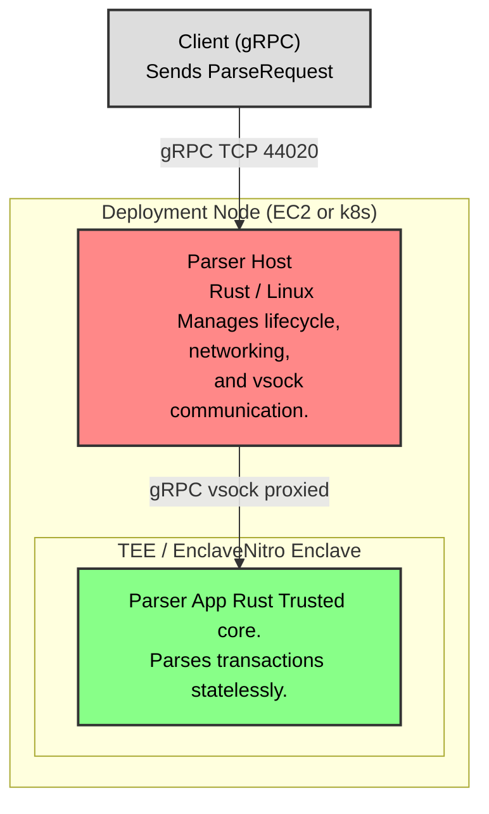

# Container Diagram (C4 Level 2)

This diagram zooms into the `VisualSign Parser` system boundary, showing the separation between the untrusted Host and the trusted Enclave.

## Critical Boundaries

1.  **The Trust Gap**: The `Parser Host` is **untrusted**. It could be compromised by an attacker with root access to the VM.
2.  **The Enclave**: The `Parser App` runs in a TEE (Trusted Execution Environment). It accepts inputs only via a restricted channel (vsock) and has no direct network access.
3.  **Communication**: The gRPC requests are proxied from the Host's public port to the Enclave's vsock listener.

## Components

-   **Parser Host**:
    -   Likely `parser_host` binary.
    -   Responsibilities: OS-level networking, metrics collection, health checks (external), forwarding requests to enclave.
-   **Parser App**:
    -   Likely `parser_app` binary.
    -   Responsibilities: Proto decoding, chain-specific logic, intent construction.

