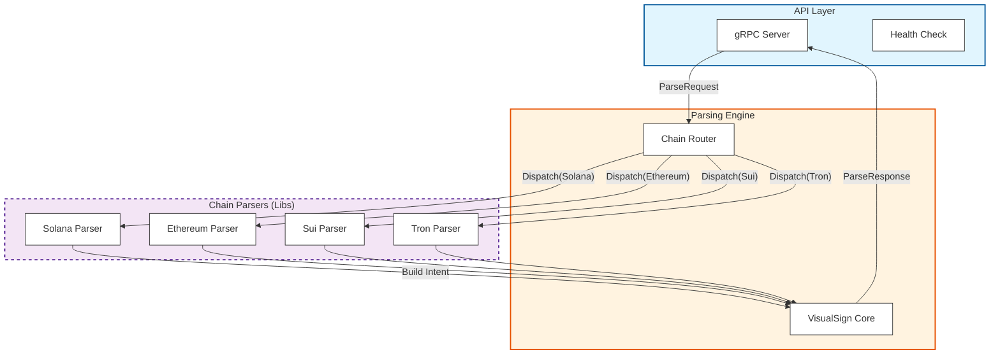

# Component Diagram (C4 Level 3)

Focusing on the **Parser App** (the trusted component).

## Component Responsibilities

### API Layer
-   **gRPC Server**: `tonic`-based server listening on the internal socket (vsock). Deserializes `ParseRequest`.
-   **Health Check**: Implements `grpc.health.v1` to report enclave status.

### Parsing Engine
-   **Chain Router**: Determines which sub-parser to use based on the `Chain` enum (e.g., `CHAIN_SOLANA`).
-   **VisualSign Core** (`visualsign` crate):
    -   Defines standard `ParsedTransaction` and `Signature` types.
    -   Provides builder patterns and traits (`Parse` trait) for consistency.

### Chain Parsers (`chain_parsers/`)
-   **Solana Parser**: Handles `Instruction` decoding, looks up "Presets" (hardcoded parsers for System Program, SPL Token, Jupiter), or falls back to generic IDL parsing if provided.
-   **Ethereum Parser**: RLP decoding, ABI decoding (if metadata provided), ERC-20/721 standard recognition.
-   **Sui Parser**: BCS decoding, Move call inspection.
-   **Tron Parser**: Protobuf decoding (Tron uses protobuf for txs).

## Key Invariants
-   **Isolation**: Chain parsers do not share mutable state.
-   **Stateless**: Each `Parse()` call is independent.

