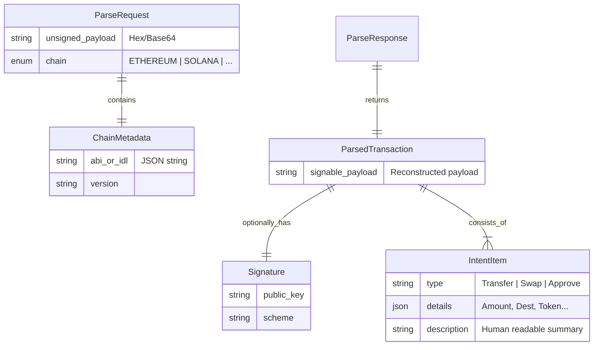

# Data Model

The core data model defines the input (raw bytes) and output (semantic intent).

## Data Dictionary

### 1. ParseRequest
The entry point.
-   `unsigned_payload`: The exact bytes to be signed. **Critical**: The parser operates on *this* payload, not a hash.
-   `chain`: Discriminator for the parsing logic.
-   `chain_metadata`: Optional context. If the transaction interacts with an unknown smart contract, the caller can provide the ABI/IDL here. *Security Note*: The parser must verify the payload matches the ABI if possible, or mark the output as "derived from user-provided metadata".

### 2. ParsedTransaction
The "VisualSign".
-   Structure is generic to support all chains.
-   Instead of raw "calldata", it returns high-level concepts (e.g., "Transfer 5 USDC").

### 3. Presets & Registry
Internally, the system maintains a registry of "Presets" (Parsers for specific contracts).
-   **Key**: `(Chain, ProgramID/Address)`
-   **Value**: `Parser Implementation`
-   *Example*: A Solana transaction to `JUP...` invokes the `JupiterSwap` preset, which knows how to decode the route data.

## Invariants
1.  `ParsedTransaction` must fully cover the effects of `unsigned_payload`. Hidden effects are a security failure.
2.  If parsing fails or is ambiguous, return an `Error`, never a partial/guess result.

