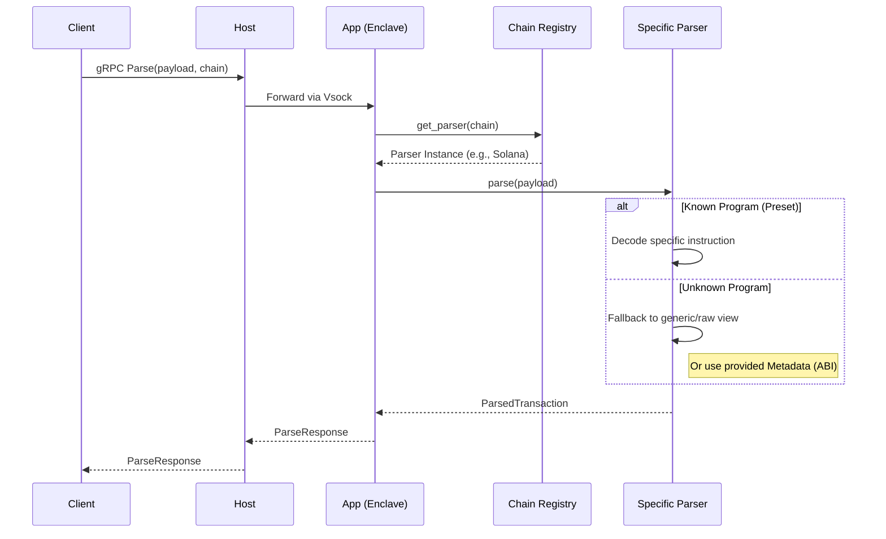
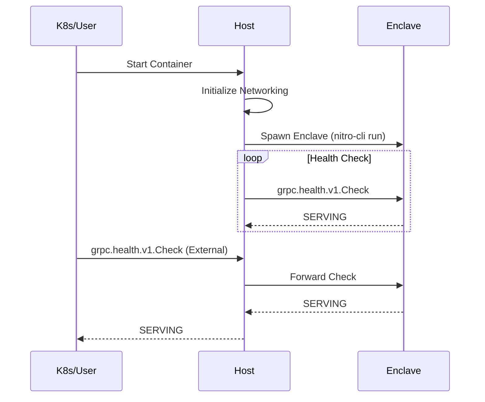

# Sequence Diagrams

## 1. Standard Parse Flow

The most common operation: a client asks the system to explain a transaction.

## 2. Startup & Health Check

Ensuring the enclave is healthy and reachable.

