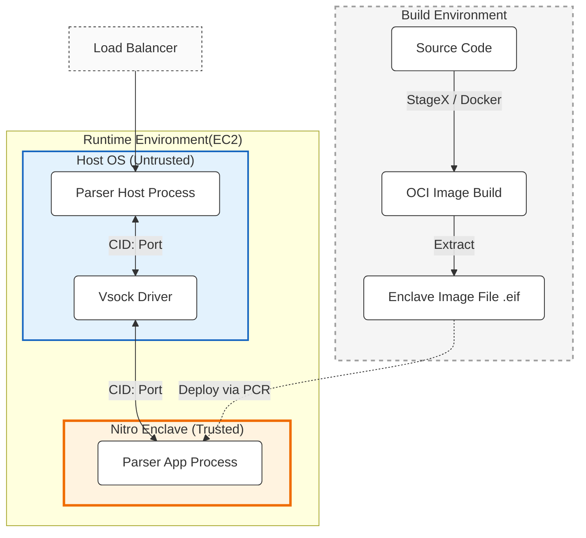

# Deployment

The system is designed for OCI-compatible container orchestration, specifically targeting environments with Enclave support (AWS Nitro).

## Configuration

Configuration is minimal and mostly build-time to reduce runtime attack surface.

-   **Chain Support**: Compiled in via Cargo Features (e.g., `feature = "solana"`).
-   **Listen Address**: Hardcoded or CLI arg (internal vsock port).

## Feature Flags

The `Cargo.toml` should control which chain parsers are included in the binary to minimize binary size and attack surface.

| Feature | Description |
| :--- | :--- |
| `chain-ethereum` | Includes `visualsign-ethereum` crate. |
| `chain-solana` | Includes `visualsign-solana` crate. |
| `chain-sui` | Includes `visualsign-sui` crate. |
| `simulator` | Enables non-enclave simulation mode for local dev/testing. |

